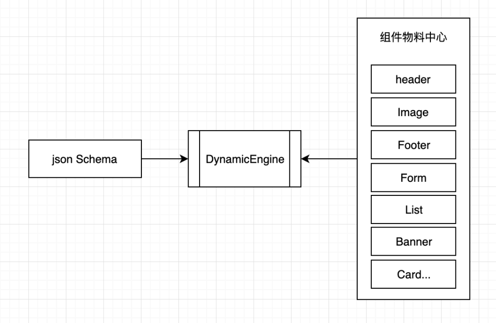

<!--
 * @Date: 2021-01-17 14:24:40
 * @LastEditors: chentianshang
 * @LastEditTime: 2021-01-17 19:42:53
 * @FilePath: /github-h5-Dooring/doc/zh/guide/componentDev/dynamicLoading.md
-->

# 组件动态加载

目前 H5-Dooring 的组件都是通过动态加载的方式引入，好处是我们在页面中只会加载我们需要的组件，不需要的组件不会被加载，这样可以提高页面加载的速度，这样做也会出现一些问题，比如一个长页面，配置了很多组件，那么一个页面加载过程可以会触发多次请求，目前还没有遇到性能问题，但后续会逐渐优化这个问题。

## umi3 提供的 dynamic

目前组件的动态加载我们采用的 umi 的 dynamic 方案，基于它我们上层封装了一个组件动态加载器，原理如下：

具体代码可以参考 Dooring 的 Github 地址：[https://github.com/MrXujiang/h5-Dooring](https://github.com/MrXujiang/h5-Dooring)
