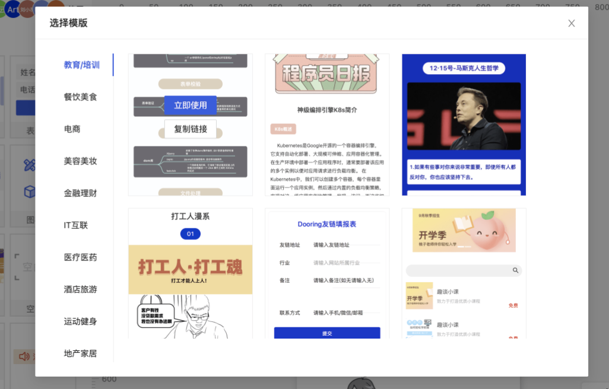

<!--
 * @Date: 2021-01-17 14:25:29
 * @LastEditors: chentianshang
 * @LastEditTime: 2021-01-17 21:48:34
 * @FilePath: /github-h5-Dooring/doc/zh/guide/functionRealization/templateLibrary.md
-->
## 模板库实现思路

我们目前开放了模板库功能，一方面我们会定期配置行业模板，另一个方面Dooring还支持用户自己配置模板，可以一键保存到云端供用户使用。我们也可以将模板变成自己的页面共享给其他人。实现方式本质上是保存用户的配置信息，上传到服务器中做存储，在后台提供了管理模板的模块，可以修改，删除模板。如下图所示：

### 模板前台展示：

### 模板后台展示：

