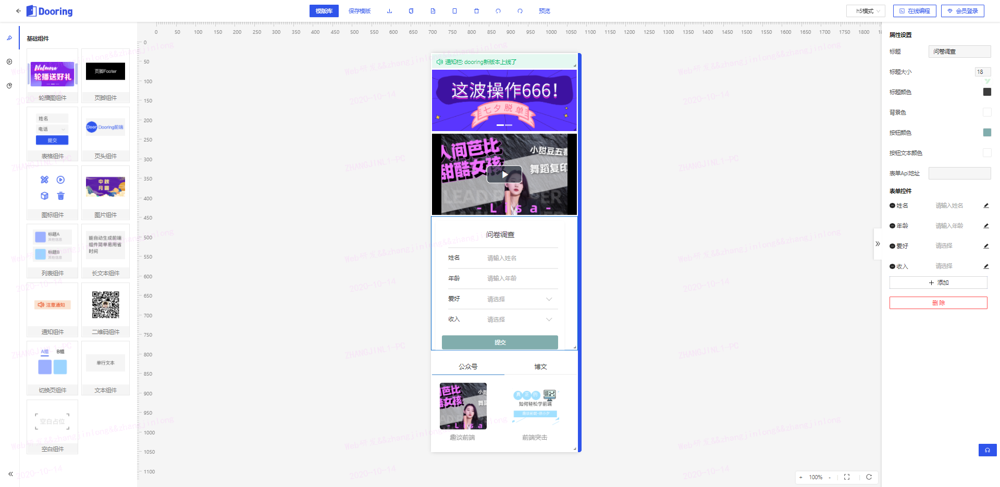

<p align="center">
    
</p>
<h1 align="center">Welcome to H5-Dooring 👋</h1>
<p>
  
  <a href="https://juejin.im/post/6864410873709592584/" target="_blank">
    
  </a>
  <a href="#" target="_blank">
    
  </a>
</p>

> H5-Dooring是一款功能强大，开源免费的H5可视化页面配置解决方案，致力于提供一套简单方便、专业可靠、无限可能的H5落地页最佳实践。技术栈以react为主， 后台采用nodejs开发。

> H5-Dooring is a powerful, open source, free H5 visual page configuration solution dedicated to providing a simple, convenient, professional and reliable, unlimited set of H5 landing page best practices. The technology stack is mainly react, developed in the background using nodejs.

### 🏠 [Homepage](http://49.234.61.19/h5_visible)

### ✨ [Demo](http://49.234.61.19/h5_plus/editor?tid=123456)

<!--  -->


## Author

👤 **徐小夕**

* Website: http://49.234.61.19/h5_visible
* Github: [@MrXujiang](https://github.com/MrXujiang)

## 🤝 Contributing

Contributions, issues and feature requests are welcome!<br />Feel free to check [issues page](https://github.com/MrXujiang/h5-Dooring/issues).

## Show your support

Give a ⭐️ if this project helped you!

## 技术栈 | The technology stack
* **React** 前端主流框架(react,vue,angular)之一,更适合开发灵活度高且复杂的应用
* **dva** 主流的react应用状态管理工具，基于redux
* **less** css预编译语言，轻松编写结构化分明的css
* **umi** 基于react的前端集成解决方案
* **antd** 地球人都知道的react组件库
* **axios** 强大的前端请求库
* **react-dnd** 基于react的拖拽组件解决方案，具有优秀的设计哲学
* **qrcode.react** 基于react的二维码生成插件
* **zarm** 基于react的移动端ui库，轻松实现美观的H5应用
* **koa** 基于nodejs的上一代开发框架，轻松实现基于nodejs的后端开发
* **@koa/router** 基于koa2的服务端路由中间件
* **ramda** 优秀的函数式js工具库

### 预览功能 | Preview features
预览功能这块比较简单, 我们只需要将用户生成的json数据丢进H5渲染器中即可, 这里我们需要做一个渲染页面单独用来预览组件. 先来看看几个预览效果:
> The preview function is relatively simple, we just need to throw the user-generated jason data into the H5 renderer, here we need to make a rendering page for the preview components separately. Let's take a look at a few previews:


<br />


前面的渲染器原理已经介绍了, 这里就不一一介绍了,感兴趣的可以交流讨论.

### 实现在线下载功能 | Enable online download
在线下载这块我们需要用到一个开源库: **file-saver**, 专门解决前端下载文件困难的窘境. 具体使用举例:
``` js
var FileSaver = require('file-saver');
var blob = new Blob(["Hello, world!"], {type: "text/plain;charset=utf-8"});
FileSaver.saveAs(blob, "hello world.txt");
```
以上代码可以实现将传入的数据下载为txt文件, 如果是Blob, 是不是还能在线下载图片, html呢? 答案是肯定的, 所以我们的下载任务采用该方案来实现.

### 后端部分 | The back-end section
后端部分由于涉及的知识点比较多, 不是本文考虑的重点, 所以这里大致提几个点, 大家可以用完全不同的技术来实现后台服务, 比如说**PHP**, **Java**, **Python**或者**Egg**. 笔者这里采用的是**koa**. 主要实现功能如下:
* 保存模板 | Save the template
* 真机预览的数据源存储 | The data source store for the real machine preview
* 用户相关功能 | User-related features
* H5图床和静态文件托管 | H5 map bed and static file hosting

具体代码可以参考笔者的另一篇全栈开发文章

[基于nodeJS从0到1实现一个CMS全栈项目](https://juejin.im/post/6844903952761225230)

模式基本一致.

## wiki(参考文档)
* [H5可视化编辑器(H5 Dooring)介绍](https://github.com/MrXujiang/h5-Dooring/wiki/H5%E5%8F%AF%E8%A7%86%E5%8C%96%E7%BC%96%E8%BE%91%E5%99%A8(H5-Dooring)%E4%BB%8B%E7%BB%8D)
* [Form Editor(动态表单设计器)](https://github.com/MrXujiang/h5-Dooring/wiki/Form-Editor(%E5%8A%A8%E6%80%81%E8%A1%A8%E5%8D%95%E8%AE%BE%E8%AE%A1%E5%99%A8))
* [基于f2实现移动端可视化编辑器(dooring升级版)](https://github.com/MrXujiang/h5-Dooring/wiki/%E5%9F%BA%E4%BA%8Ef2%E5%AE%9E%E7%8E%B0%E7%A7%BB%E5%8A%A8%E7%AB%AF%E5%8F%AF%E8%A7%86%E5%8C%96%E7%BC%96%E8%BE%91%E5%99%A8(dooring%E5%8D%87%E7%BA%A7%E7%89%88))
* [实现H5可视化编辑器的实时预览和真机扫码预览功能](https://github.com/MrXujiang/h5-Dooring/wiki/%E5%AE%9E%E7%8E%B0H5%E5%8F%AF%E8%A7%86%E5%8C%96%E7%BC%96%E8%BE%91%E5%99%A8%E7%9A%84%E5%AE%9E%E6%97%B6%E9%A2%84%E8%A7%88%E5%92%8C%E7%9C%9F%E6%9C%BA%E6%89%AB%E7%A0%81%E9%A2%84%E8%A7%88%E5%8A%9F%E8%83%BD)
* [基于H5 Dooring场景下的图片 文件上传方案指南](https://github.com/MrXujiang/h5-Dooring/wiki/%E5%9F%BA%E4%BA%8EH5-Dooring%E5%9C%BA%E6%99%AF%E4%B8%8B%E7%9A%84%E5%9B%BE%E7%89%87-%E6%96%87%E4%BB%B6%E4%B8%8A%E4%BC%A0%E6%96%B9%E6%A1%88%E6%8C%87%E5%8D%97)

## 已完成功能 | The functionality is complete
1. 组件库拖拽和显示
2. 组件库动态编辑
3. H5页面预览功能
4. 保存H5页面配置文件
5. 保存为模版
6. 移动端跨端适配
7. 媒体组件
8. 在线下载网站代码功能
9. 添加typescript支持
10. 表单设计器/自定义表单组件
11. 可视化组件Chart实现
12. 在线编程模块(Mini Web IDE)
13. 新增图表组件 面积图，折线图， 饼图
14. 添加图片库,支持用户在线选择图片素材
15.升级图片组件为图文组件
16. 添加模版库
17. 添加可视化组件(基于g2)如折线图, 饼图, 面积图等
18. form组件文本框字段修改
19. 清空按钮添加确认框
20. 表单组件中添加展示型文本,用来对字段说明
21. 支持组件复制, 右键删除

## 正在完成功能 | The functionality is being completed
* 丰富组件库组件 Enrich component library components
* 添加配置交互功能 Add configuration interaction
* 组件细分和代码优化 Component segmentation and code optimization
* 单元测试 Unit tests

## Install(安装)
1. 下载代码 | Download the code
```sh
git clone https://github.com/MrXujiang/h5-Dooring.git
```
2. 进入项目目录 | Go to the project catalog
```sh
cd ./h5-Dooring
```

3. 安装依赖包 | Install the dependency package
```sh
yarn install
or
cnpm install
```

## Usage

本地启动应用 | Launch the app locally
```sh
yarn start
or
cnpm run start
```

## How to run the downloaded code ?

 1. 可以将压缩包解压直接放到服务器根目录, 访问根目录地址即可
 2. `vscode`安装Live Server插件, 将下载的压缩包解压成文件夹, 用`vscode`打开, 点击Live Server即可, 注意要删除启动路径的`index.html`, 改成`/`


如发现本地启动后组件拖拽遇到奇怪的报错, 是应为第三方组件在开发环境的bug, 可以采用一下方式解决:
> If you find that the local start-up component drag encountered strange errors, is a bug that should be a third-party component in the development environment, can be resolved in a way:

```sh
yarn dev
or
cnpm run dev
```
前提是先安装http-server模块.

## Partner project
* [Luckysheet - 强大的在线excel编辑器](https://github.com/mengshukeji/Luckysheet)
* [Blink - 一款自定义的生成故障艺术动画的组件库](https://github.com/MrXujiang/blink)
* [frontend-developer-roadmap | 一个能提高开发者工作效率的前端js库汇总](https://github.com/MrXujiang/frontend-developer-roadmap)

## 更新日志 | Update the log
1. 添加在线编程模块（在执行代码前先启动node服务 npm run server）
2. 添加客服机器人模块[chatbot-antd](https://www.npmjs.com/package/chatbot-antd)
3. 添加数据可视化模块
4. 添加表单定制模块


## 持续升级 | Continuous upgrades
正在升级1.5版本，敬请期待...

## 赞助 | Sponsored
开源不易, 有了您的赞助, 我们会做的更好~


## 技术反馈和交流 | Technical feedback and communication
微信：beautifulFront


## 技术交流群(加作者微信进群) | chat whit author

